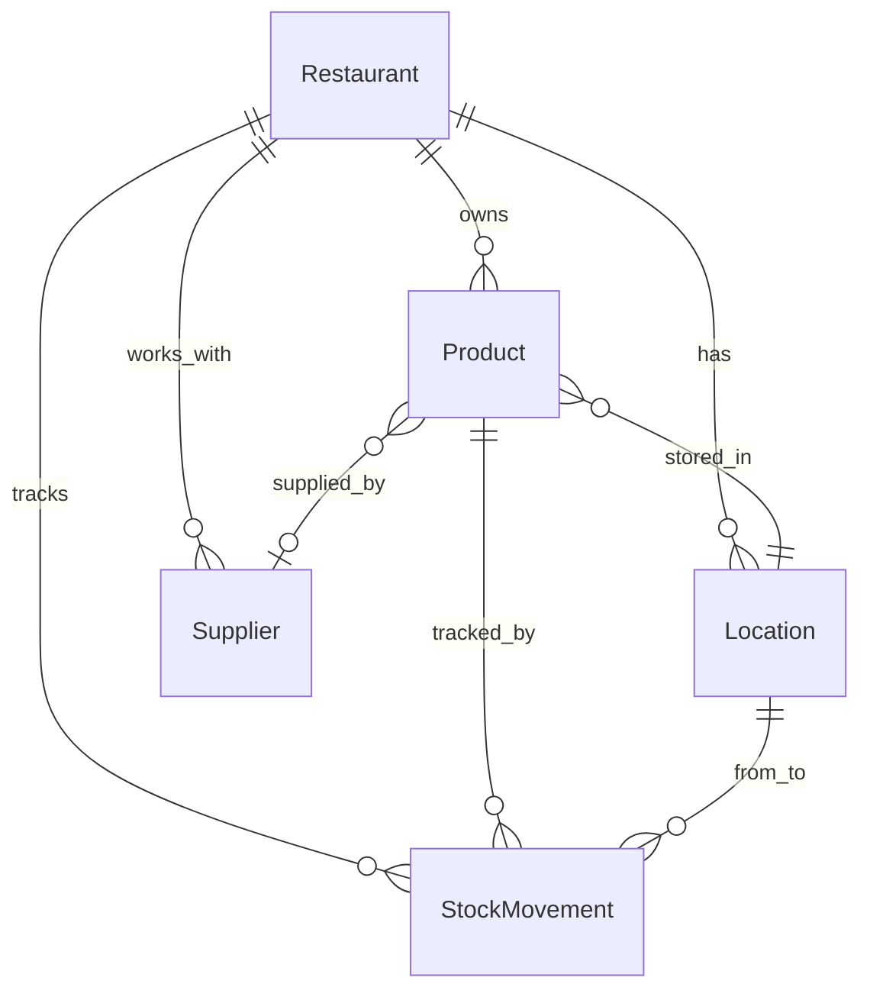

# 🏪 Tandem - Système de Gestion d'Inventaire

[](https://opensource.org/licenses/MIT)
[](https://nodejs.org/)
[](https://www.typescriptlang.org/)
[](https://nextjs.org/)
[](https://www.prisma.io/)
[](https://supabase.com/)

Un système de gestion d'inventaire moderne et complet pour restaurants et établissements de restauration, développé avec Next.js, Express.js et Supabase.

## ✨ Fonctionnalités

### 🏪 Gestion d'Inventaire
- **Produits** : Gestion complète des articles avec codes-barres, SKU, et seuils de stock
- **Emplacements** : Organisation multi-sites (cuisine, réserve, etc.)
- **Mouvements de stock** : Suivi des entrées, sorties et ajustements
- **Alertes** : Notifications automatiques pour les stocks faibles

### 📦 Achats & Ventes
- **Commandes fournisseurs** : Gestion des achats et réceptions
- **Ventes** : Enregistrement et suivi des transactions
- **Retours** : Gestion des retours clients et fournisseurs

### 🏷️ Codes-barres
- **Génération d'étiquettes** : Impression pour articles et lots
- **Scan mobile** : Lecture de codes-barres avec caméra

### 📊 Rapports & Analytics
- **Tableau de bord** : Vue d'ensemble des métriques clés
- **Analyse des ventes** : Tendances et statistiques
- **Rapports de stock** : Historique et projections

### 🎯 Centre de Données
- **Gestion des partenaires** : Fournisseurs et clients
- **Attributs personnalisés** : Configuration flexible
- **Sites multiples** : Support multi-emplacements

## 🚀 Technologies

### Frontend
- **Next.js 14** - Framework React avec App Router
- **TypeScript** - Typage statique
- **Tailwind CSS** - Framework CSS utilitaire
- **React Hook Form** - Gestion des formulaires

### Backend
- **Express.js** - Serveur API REST
- **Prisma ORM** - Base de données et migrations
- **TypeScript** - API typée

### Base de Données
- **Supabase** - PostgreSQL hébergé avec authentification
- **Prisma** - ORM et gestion des migrations

### Infrastructure
- **GitHub** - Contrôle de version
- **Node.js 18+** - Runtime JavaScript

## 📋 Prérequis

- **Node.js** 18.0 ou supérieur
- **npm** ou **yarn**
- **Compte Supabase** pour la base de données
- **Git** pour le contrôle de version

## 🛠️ Installation

### 1. Cloner le repository

```bash
git clone https://github.com/maxgambino/tandem-inventory.git
cd tandem-inventory
```

### 2. Installer les dépendances

```bash
# Installer les dépendances racine
npm install

# Installer les dépendances backend
cd apps/backend
npm install

# Installer les dépendances frontend
cd ../web
npm install
```

### 3. Configuration de la base de données

1. Créer un projet sur [Supabase](https://supabase.com)
2. Copier les informations de connexion
3. Créer le fichier `.env` dans `apps/backend/` :

```env
DATABASE_URL="postgresql://postgres:[VOTRE_MOT_DE_PASSE]@[VOTRE_PROJET].supabase.co:5432/postgres"
```

4. Créer le fichier `.env.local` dans `apps/web/` :

```env
NEXT_PUBLIC_SUPABASE_URL="https://[VOTRE_PROJET].supabase.co"
NEXT_PUBLIC_SUPABASE_ANON_KEY="[VOTRE_CLE_ANON]"
```

### 4. Initialiser la base de données

```bash
cd apps/backend
npx prisma db push
npx prisma generate
node seed-supabase.js
```

### 5. Démarrer l'application

```bash
# Terminal 1 - Backend (Port 3001)
cd apps/backend
npm run dev

# Terminal 2 - Frontend (Port 3000)
cd apps/web
npm run dev
```

L'application sera accessible sur :
- **Frontend** : http://localhost:3000
- **Backend API** : http://localhost:3001

## 📁 Structure du Projet

```
tandem/
├── apps/
│   ├── backend/           # API Express.js
│   │   ├── src/
│   │   │   ├── api/       # Routes API
│   │   │   └── index.ts   # Point d'entrée
│   │   ├── prisma/        # Schéma et migrations
│   │   └── package.json
│   └── web/               # Application Next.js
│       ├── app/           # Pages et composants
│       ├── lib/           # Utilitaires
│       └── package.json
├── package.json           # Scripts racine
└── README.md
```

## 🗄️ Modèle de Données

### Entités Principales

- **Restaurant** : Établissement principal
- **Location** : Emplacements de stockage
- **Product** : Articles de l'inventaire
- **Supplier** : Fournisseurs
- **StockMovement** : Mouvements de stock
- **Attribute** : Attributs personnalisés

### Relations



## 🔌 API Endpoints

### Produits
- `GET /api/products` - Liste des produits
- `GET /api/products/:id` - Détail d'un produit
- `POST /api/products` - Créer un produit
- `PUT /api/products/:id` - Modifier un produit
- `DELETE /api/products/:id` - Supprimer un produit

### Stock
- `GET /api/stock/items` - État du stock
- `POST /api/stock/movements` - Enregistrer un mouvement
- `GET /api/stock/movements` - Historique des mouvements

### Emplacements
- `GET /api/locations` - Liste des emplacements
- `GET /api/locations/:id` - Détail d'un emplacement

### Fournisseurs
- `GET /api/suppliers` - Liste des fournisseurs
- `POST /api/suppliers` - Créer un fournisseur

## 🎨 Interface Utilisateur

### Pages Principales

- **🏠 Dashboard** - Vue d'ensemble
- **📦 Inventaire** - Gestion des stocks
- **🛒 Achats** - Commandes fournisseurs
- **💰 Ventes** - Transactions clients
- **🏷️ Codes-barres** - Génération d'étiquettes
- **📊 Rapports** - Analytics et statistiques
- **⚙️ Paramètres** - Configuration

### Design

- Interface moderne et responsive
- Navigation intuitive avec sidebar
- Composants réutilisables
- Design system cohérent

## 🧪 Tests

```bash
# Tests backend
cd apps/backend
npm test

# Tests frontend
cd apps/web
npm test
```

## 🚀 Déploiement

### Vercel (Frontend)

```bash
cd apps/web
npm run build
# Déployer sur Vercel
```

### Railway/Heroku (Backend)

```bash
cd apps/backend
npm run build
# Déployer sur votre plateforme
```

## 🤝 Contribution

1. Fork le projet
2. Créer une branche feature (`git checkout -b feature/AmazingFeature`)
3. Commit vos changements (`git commit -m 'Add some AmazingFeature'`)
4. Push vers la branche (`git push origin feature/AmazingFeature`)
5. Ouvrir une Pull Request

## 📝 Roadmap

- [ ] Authentification utilisateur
- [ ] Notifications push
- [ ] Application mobile
- [ ] Intégration comptable
- [ ] Multi-langues
- [ ] API GraphQL

## 📄 Licence

Ce projet est sous licence MIT. Voir le fichier [LICENSE](LICENSE) pour plus de détails.

## 👨‍💻 Auteur

**Max Gambino**
- GitHub: [@maxgambino](https://github.com/maxgambino)

## 🙏 Remerciements

- [Next.js](https://nextjs.org/) - Framework React
- [Prisma](https://www.prisma.io/) - ORM moderne
- [Supabase](https://supabase.com/) - Backend-as-a-Service
- [Tailwind CSS](https://tailwindcss.com/) - Framework CSS

---

⭐ Si ce projet vous aide, n'hésitez pas à lui donner une étoile !


